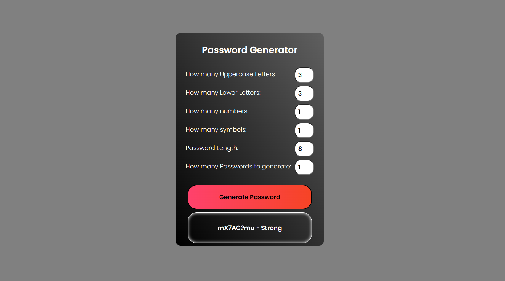
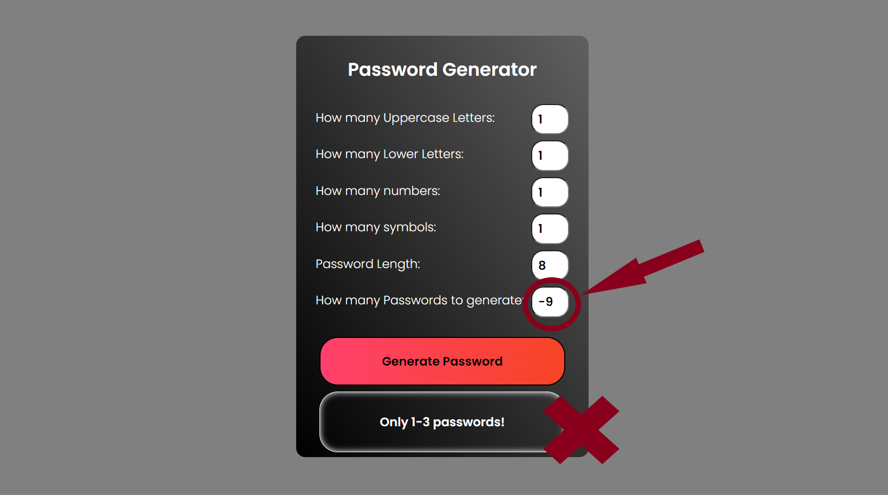
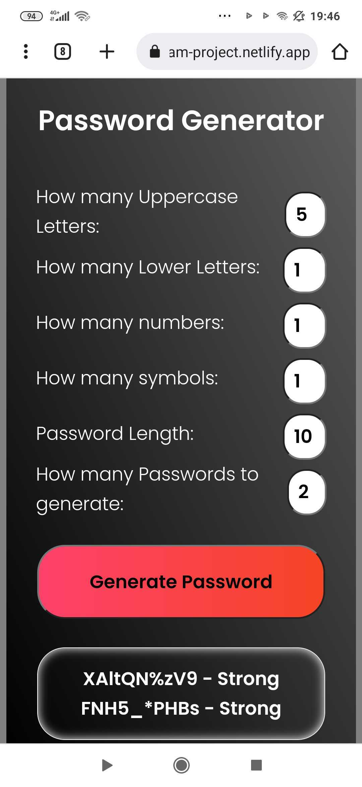

# 🚀 Team Project - Passwords Generator
we were given a task @AppleSeeds Bootcamp to make a Passwords Generator app while only using ```JavaScript```

We decided it is a bit simple for us and added ```HTML``` & ```CSS``` to make it more interesting

<br />

### Our design was straightforward and simple and we made sure to include:


#### User special picks 
That allows the user to pick how many upper/lower case chars he want as a base as well as how many special chars and numbers.

#### User decide length of the password
The user can pick how long the password is in the range of 8 - 16.

#### User can ask for more than 1 password at a time
The user can as from 1 - 3 passwords at a time with the same settings.

#### Password strength indicator
Generated passwords will display how strong they are for example ```1111111111 - weak``` or ```1AafsE#$w@Z - best!```
passwords ranked are  -weak  -basic -strong  -best!

#### Password inputs validation checks
if the user will go outside the paremeters of the form the app will display an error message with what went worng.

#### App responsiveness
We made sure that you the app is useable for smaller screens as well.

<br />


## Demo site link

https://password-generator-team-project.netlify.app/


<br />


## Screenshots

 

 

 

 


## Deployment

To deploy this project run

```bash
  ./index.html
```
This is a basic site with only one page of ```HTML``` , ```JavaScript``` and ```CSS``` styling

#### Team - Ran, Elad, Yousef & Farid.
